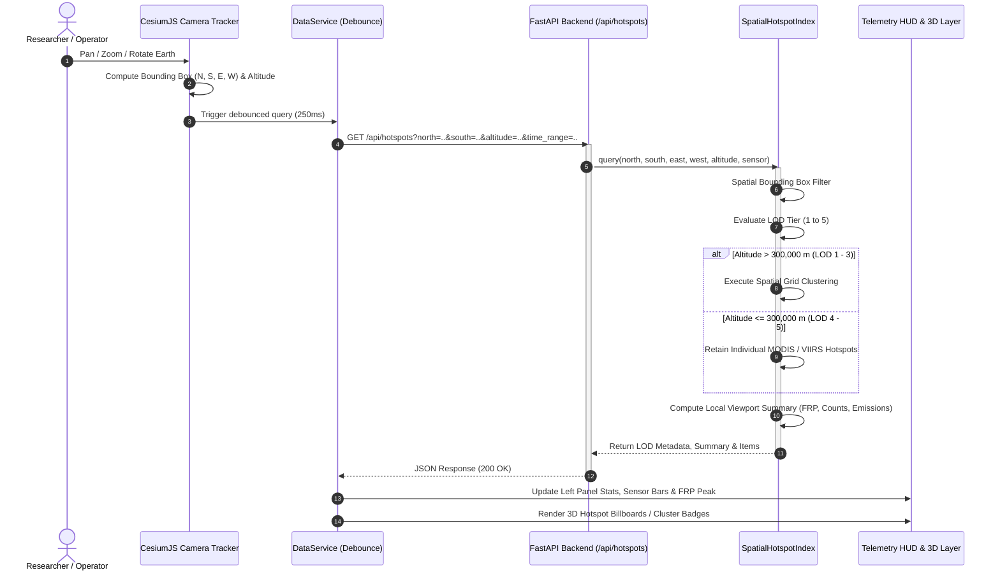
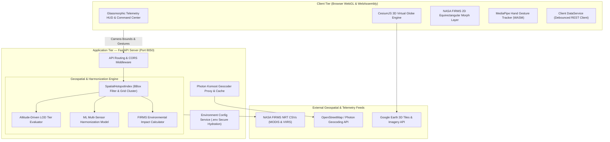

# 🌍 EarthPulse 3D: Camera-Driven Geospatial Wildfire & Biosphere Telemetry

[](https://www.python.org/)
[](https://fastapi.tiangolo.com/)
[](https://cesium.com/platform/cesiumjs/)
[](https://firms.modaps.eosdis.nasa.gov/)
[](https://developers.google.com/mediapipe)
[](https://opensource.org/licenses/MIT)

**EarthPulse 3D** is an enterprise-grade, camera-driven orbital geospatial monitoring platform engineered with **FastAPI**, **CesiumJS**, and **WebAssembly (WASM)**. Built to process massive-scale environmental telemetry from NASA's Earth Observing System satellites (**Terra**, **Aqua**, **Suomi-NPP**, and **NOAA-20**), EarthPulse dynamically harmonizes multi-sensor active fire observations, performs viewport-bounded spatial querying with altitude-driven Level-of-Detail (LOD) clustering, and renders high-fidelity 3D/2D planetary visual analytics in real time.

- **Repository**: [https://github.com/Turjo101365/EarthPulse](https://github.com/Turjo101365/EarthPulse)
- **Primary Stack**: FastAPI (Python 3.10+) • CesiumJS 1.119 • MediaPipe Vision WASM • Glassmorphism UI
- **Default Port**: `http://localhost:8050` (Local / Docker ready)
- **Spatial Engine**: Bounding-Box Dynamic Quadtree/Grid LOD Indexing with debounced camera tracking

---

## Table of Contents
1. [Why EarthPulse?](#why-earthpulse)
2. [What EarthPulse Does](#what-earthpulse-does)
3. [Camera-Driven Telemetry Lifecycle](#camera-driven-telemetry-lifecycle)
4. [System Architecture](#system-architecture)
5. [Level of Detail (LOD) Dynamic Hierarchy](#level-of-detail-lod-dynamic-hierarchy)
6. [Dual-View Paradigm: 3D Globe vs. NASA FIRMS 2D GIS](#dual-view-paradigm-3d-globe-vs-nasa-firms-2d-gis)
7. [Project Structure](#project-structure)
8. [Local Development & Setup](#local-development--setup)
9. [Camera & AI Hand Gesture Navigation](#camera--ai-hand-gesture-navigation)
10. [REST API Documentation](#rest-api-documentation)
11. [Brand Identity & Logo Suite](#brand-identity--logo-suite)
12. [Testing & Quality Assurance](#testing--quality-assurance)
13. [Project Context & Engineering Background](#project-context--engineering-background)
14. [Roadmap & Future Enhancements](#roadmap--future-enhancements)
15. [License & Acknowledgments](#license--acknowledgments)

---

## Why EarthPulse?

Global wildfires and biomass burning events release gigatons of $CO_2$, destroy critical biodiversity, and cause catastrophic economic disruptions across vulnerable biomes—from the Amazon Basin, Siberian Taiga, and Australian Bush to South Asian agricultural fire zones. However, classical remote-sensing portals suffer from significant architectural bottlenecks:

- **Viewport Telemetry Explosion**: Rendering hundreds of thousands of active raw satellite coordinates globally in browser WebGL contexts creates severe memory bloat, frame drops, and browser crashes.
- **Sensor Discrepancy & Scale Mismatch**: NASA FIRMS operates two divergent sensor constellations with conflicting spatial footprints: **MODIS** (1,000m resolution, multi-decade historical baseline) and **VIIRS** (375m resolution, higher sensitivity to small sub-pixel fires). Merging these feeds without normalization creates distorted risk metrics.
- **Static Map Limitations**: Traditional 2D GIS portals lack global planetary context, terrain elevation depth, and immersive orbital exploration required for crisis management and research.
- **Lack of Real-Time Viewport Analytics**: Users zooming into a specific country, division, or city often cannot get localized, instant breakdowns of Fire Radiative Power (FRP), day/night passes, or environmental burned area calculations without heavy manual polygon queries.

**EarthPulse solves this through an engineered separation of concerns**:
1. **Camera-Driven Viewport Filtering**: The browser camera acts as a dynamic spatial query generator. Camera movements continuously transmit the visible geographic bounding box (`North, South, East, West`) and altitude to the backend, loading only visible data.
2. **Altitude-Adaptive Level of Detail (LOD)**: From high-orbit Space View (>3,500 km) down to high-precision street-level inspections (<50 km), the spatial index dynamically switches between macro grid clustering, regional grouping, and raw individual detections to maintain 60 FPS performance.
3. **Multi-Sensor Harmonization Core**: Standardizes Fire Radiative Power (MW) across MODIS and VIIRS, normalizes spatial resolution deltas, and computes machine-learning fire probability scores.
4. **Instant Dual-Mode Morphing**: Effortlessly switches between photorealistic 3D orbital space and an equirectangular 2D NASA FIRMS GIS projection without page reloads.

---

## What EarthPulse Does

- **Camera-Driven Orbital Streaming**: Continuous debounced telemetry streaming synchronized with CesiumJS camera altitude, orientation, and geographic viewport bounding coordinates.
- **5-Stage Altitude LOD Pipeline**: Automatic transition across 5 discrete LOD tiers: Macro Space Density ➔ Continental Clustering ➔ Country Divisions ➔ District Detections ➔ High-Precision Telemetry Inspection.
- **Multi-Sensor Harmonization (MODIS & VIIRS)**: Ingestion and standardization of MODIS (Terra/Aqua, 1km) and VIIRS (S-NPP/NOAA-20, 375m) observations into unified risk levels (`CRITICAL`, `HIGH`, `MODERATE`, `LOW`).
- **Environmental Impact Analytics Engine**: Real-time calculations of total burned area ($km^2$ and hectares), carbon emissions ($Mt\ CO_2$), methane release ($kt\ CH_4$), and total thermal energy ($GW$).
- **Dual 3D / 2D GIS Projections**: One-click smooth camera morph between 3D photorealistic Cesium globe and 2D equirectangular NASA FIRMS GIS map.
- **Historical 7-Day Time-Lapse Player**: Dynamic timeline scrubber enabling day-by-day analysis (`Today` through `T-6`) with automated play/pause animation.
- **AI Hand-Gesture Navigation (MediaPipe WASM)**: Touchless orbital navigation via webcam—pan, zoom, lock, and fly-to gestures powered by local WebAssembly machine learning.
- **Global OSM Photon Geocoding**: Instant search bar with worldwide location resolution and automatic camera fly-to altitude based on place hierarchy (country, administrative, city).
- **Secure Architecture**: Server-side `.env` configuration pattern protecting Google Earth API keys while providing clean `/api/config` hydration to client applications.

---

## Camera-Driven Telemetry Lifecycle



---

## System Architecture



---

## Level of Detail (LOD) Dynamic Hierarchy

To guarantee optimal 60 FPS rendering under massive global point clouds, the system uses an altitude-driven Level of Detail engine:

| Tier | Altitude Threshold | Viewport Scope | Visual Representation | Telemetry Aggregation |
|:---|:---|:---|:---|:---|
| **LOD 1** | **> 3,500 km** | Space View | Global macro-density cells (8.0° grid) | Global Earth summary, MODIS vs. VIIRS breakdown |
| **LOD 2** | **1,200 – 3,500 km** | Continental View | Sub-continental cluster badges (3.0° grid) | Regional fire prevalence, collective FRP, risk score |
| **LOD 3** | **300 – 1,200 km** | Country / Division View | Division clusters (0.8° grid, e.g. Bangladesh sectors) | National statistics, average FRP, burned area estimation |
| **LOD 4** | **50 – 300 km** | City / District View | Discrete hotspot markers (MODIS 1km, VIIRS 375m) | Sub-district point density, peak fire power |
| **LOD 5** | **< 50 km** | High-Precision View | Interactive 3D pulsing markers with click inspection | Complete telemetry (FRP, Kelvin, Confidence %, ML Prob) |

---

## Dual-View Paradigm: 3D Globe vs. NASA FIRMS 2D GIS

EarthPulse provides two complementary views designed for different analytical workflows:

| Feature Dimension | 🌐 3D Photorealistic Globe | 🗺️ NASA FIRMS 2D Equirectangular |
|:---|:---|:---|
| **Projection** | WGS84 Ellipsoid (3D Sphere) | EPSG:4326 Equirectangular Flat Map |
| **Visual Depth** | Planetary atmosphere, terrain elevation, day/night shadow | Global planar overview, uninterrupted borderlines |
| **Camera Dynamics** | Free orbital pitch, yaw, roll, continuous zoom | Seamless 2D pan, planar coordinate tracking |
| **Analytical Use** | Realistic tactical inspection, elevation-aware fly-throughs | Cross-continental comparison, time-lapse GIS auditing |
| **Performance** | Optimized via Cesium WebGL Batching | Zero-altitude distortion, rapid macro scanning |
| **Transition** | Native 3D rendering | Smooth continuous morphing via `viewer.scene.morphTo2D()` |

---

## Project Structure

```text
EarthPulse/
├── .env.example                       # Environment configuration template
├── .gitignore                         # Git exclusion rules (protects .env & virtualenvs)
├── README.md                          # Comprehensive architectural documentation
├── run.sh                             # One-click startup script (auto-venv & launch)
│
├── backend/                           # FastAPI Application & Spatial Core
│   ├── __init__.py                    # Python package declaration
│   ├── main.py                        # REST endpoints, CORS, config & static routing
│   ├── spatial_index.py               # Viewport BBox filter, LOD clustering & analytics
│   ├── ml_harmonization.py            # MODIS & VIIRS cross-sensor harmonization engine
│   ├── data_generator.py              # In-memory hotspot storage & ingestion container
│   └── requirements.txt               # Backend dependencies (FastAPI, Uvicorn, Dotenv)
│
└── frontend/                          # Client-Side Application
    ├── index.html                     # Main glassmorphism UI & Cesium container
    ├── css/
    │   └── styles.css                 # Dark mission-control theme & HUD styles
    ├── js/
    │   ├── app.js                     # CesiumJS initialization & engine lifecycle
    │   ├── camera_controller.js       # Viewport bounding box tracker & fly-to controls
    │   ├── data_service.js            # Debounced backend REST client
    │   ├── firms_controller.js        # FIRMS 2D mode, timeline player & impact drawer
    │   ├── ui_controller.js           # Telemetry cards, HUD charts & inspection modals
    │   ├── hand_tracking.js           # MediaPipe AI hand gesture recognition engine
    │   └── world_atlas.js             # Geographic boundary anchors & coordinates
    │
    ├── assets/
    │   └── logos/                     # 10 Official EarthPulse Brand Design Concepts
    │       ├── logo_concept_01_orbit_pulse.jpg
    │       ├── logo_concept_02_planetary_heartbeat.jpg
    │       ├── logo_concept_03_satellite_mission_emblem.jpg
    │       ├── logo_concept_04_dual_ribbon_sphere.jpg
    │       ├── logo_concept_05_cyber_mesh_matrix.jpg
    │       ├── logo_concept_06_squircle_app_icon.jpg
    │       ├── logo_concept_07_thermal_flare_core.jpg
    │       ├── logo_concept_08_waveform_globe.jpg
    │       ├── logo_concept_09_apex_hexagon_badge.jpg
    │       └── logo_concept_10_kinetic_orbit_rings.jpg
    │
    ├── models/
    │   └── hand_landmarker.task       # MediaPipe Hand Landmarker neural model
    ├── vendor/
    │   └── vision_bundle.mjs          # MediaPipe Vision ESM bundle
    └── wasm/                          # Local WebAssembly binaries for gesture AI
        ├── vision_wasm_internal.wasm
        └── vision_wasm_module_internal.wasm
```

---

## Local Development & Setup

### Prerequisites
- **Python 3.10+** (verified on macOS, Linux, Windows WSL)
- **Modern Browser** with WebGL2 / WebGPU support (Chrome, Edge, Firefox, Safari)
- **Webcam** *(Optional; required only for MediaPipe hand gesture tracking)*

### 1. Clone the Repository
```bash
git clone https://github.com/Turjo101365/EarthPulse.git
cd EarthPulse
```

### 2. Configure Environment Variables
Create a local `.env` file from the provided `.env.example`:
```bash
cp .env.example .env
```
Edit `.env` to include your configuration:
```env
# Google Earth / Maps Platform API Key (Optional for Photorealistic 3D Tiles)
GOOGLE_EARTH_API_KEY=YOUR_GOOGLE_EARTH_API_KEY

# Application Server Port
PORT=8050
```

### 3. Launch with Automated Script
EarthPulse includes an automated setup script that creates a virtual environment, installs dependencies, and boots the server:
```bash
chmod +x run.sh
./run.sh
```

### 4. Or Run Manually
```bash
# Create and activate virtual environment
python3 -m venv .venv
source .venv/bin/activate       # On Windows: .venv\Scripts\activate

# Install dependencies
pip install -r backend/requirements.txt

# Start FastAPI Uvicorn Server
uvicorn backend.main:app --host 0.0.0.0 --port 8050 --reload
```

Navigate to **`http://localhost:8050`** in your browser.

---

## Camera & AI Hand Gesture Navigation

EarthPulse supports dual navigation paradigms: standard hardware controls and touchless AI vision controls.

### Hardware Controls (Mouse & Keyboard)
| Action | Input Combination | Operational Behavior |
|:---|:---|:---|
| **Rotate Earth** | Left Click + Drag | Orbits the 3D globe freely around its geographic axis |
| **Zoom In / Out** | Mouse Scroll Wheel / Right Click + Drag | Changes camera altitude continuously from space to street |
| **Tilt / Pitch** | Middle Click + Drag / Ctrl + Left Drag | Adjusts camera angle to inspect terrain slope and horizon |
| **Quick Fly-To** | Quick Select Buttons in Right Drawer | Smooth cinematic flight to Bangladesh, Dhaka, Amazon, etc. |
| **Inspect Fire** | Left Click on any Hotspot Marker | Opens detailed modal card with full telemetry and sensor stats |

### AI Hand Gesture Controls (MediaPipe Vision WASM)
Click the **"🖐️ Enable Hand Tracking"** button in the top navigation to activate webcam-based touchless gesture navigation:

| Gesture Icon | Hand Gesture | Action Performed |
|:---:|:---|:---|
| 🖐️ | **Open Palm** | Rotates and pans the 3D Earth following hand velocity |
| 🤏 | **Pinch (Thumb + Index)** | Dynamic Zoom In (close pinch) and Zoom Out (open pinch) |
| ✊ | **Closed Fist** | Freezes and locks camera in place (Zen viewing mode) |
| 👍 | **Thumbs Up** | Resets camera to global Earth overview (LOD 1 Space View) |
| ✌️ | **Peace Sign (Two Fingers)** | Executes cinematic fly-to directly to Bangladesh sector |
| ☝️ | **Point (Single Finger)** | Casts laser raycast target onto the 3D planetary surface |

---

## REST API Documentation

The FastAPI backend exposes high-throughput endpoints designed for high-frequency viewport tracking and spatial aggregations:

| HTTP Method | Route | Description | Query Parameters |
|:---:|:---|:---|:---|
| `GET` | `/api/config` | Client configuration (Google Earth API key, version) | None |
| `GET` | `/api/health` | Service health status and catalog item counter | None |
| `GET` | `/api/stats/global` | Planet-wide baseline statistics and summaries | None |
| `GET` | `/api/hotspots` | Primary camera viewport endpoint with LOD clustering | `north`, `south`, `east`, `west`, `altitude`, `sensor`, `min_frp`, `time_range`, `daynight` |
| `GET` | `/api/hotspots/{id}` | Detailed telemetry lookup for an individual detection | Path param `id` |
| `GET` | `/api/firms/analytics` | Global environmental impact analytics (emissions, leaderboard, 7-day trend) | `time_range` (`24h`, `48h`, `7d`, `day_0`..`day_6`) |
| `GET` | `/api/geocode` | Global forward geocoding powered by OSM Photon Komoot | `q` (query string, min 2 chars) |

---

## Brand Identity & Logo Suite

Ten distinct brand identity concepts were developed to encapsulate the essence of **EarthPulse**—balancing planetary conservation with aerospace satellite telemetry. All assets are archived in `frontend/assets/logos/`:

| # | Concept Name | Architectural Style | Core Visual Metaphor |
|:---:|:---|:---|:---|
| **01** | **The Orbit Pulse** | Geospatial Startup Mark | Geodesic blue globe sliced by an electric neon-orange orbital trajectory |
| **02** | **Planetary Heartbeat** | Vital Signs / ECG | Electrocardiogram pulse wave transitioning from cyan to fiery magma red |
| **03** | **Satellite Mission Emblem** | NASA Goddard Mission Patch | Orbiting satellite transmitting concentric radar sonar sweeps over Earth |
| **04** | **Dual Ribbon Sphere** | Luxury Abstract 3D | Two intertwining fluid ribbons representing ocean water and thermal fire |
| **05** | **Cyber Mesh Matrix** | Sci-Fi GIS Hotspots | Wireframe globe with luminous telemetry nodes and expanding sonar rings |
| **06** | **Squircle App Icon** | Apple Glassmorphism | Polished titanium dark squircle app icon with central glowing pulse line |
| **07** | **Thermal Flare Core** | Planetary Sensor Core | Concentric orbital rings opening into a radiant solar thermal core |
| **08** | **Waveform Globe** | Eco-Metrics / Equalizer | Vertical audio frequency bars curved dynamically to trace Earth's shape |
| **09** | **Apex Hexagon Badge** | Tactical Aerospace Defense | Gunmetal hexagonal crest enclosing orbital radar surveillance telemetry |
| **10** | **Kinetic Orbit Rings** | Minimalist Swiss Flat Design | Pure circular globe encircled by dual interlocking neon kinetic rings |

---

## Testing & Quality Assurance

EarthPulse maintains strict code health and validation standards:

```bash
# 1. Validate Python backend syntax
python3 -m py_compile backend/*.py

# 2. Validate Frontend JavaScript integrity
for f in frontend/js/*.js; do node -c "$f"; done

# 3. Live API endpoint health verification
curl -s http://localhost:8050/api/health
curl -s "http://localhost:8050/api/hotspots?north=40&south=20&east=100&west=80&altitude=5000000"
curl -s http://localhost:8050/api/firms/analytics
```

---

## Project Context & Engineering Background

EarthPulse was engineered as a high-performance geospatial intelligence system by:
- **Lead Developer**: **Tanmoy Chowdhury Turjo** ([@Turjo101365](https://github.com/Turjo101365))
- **Affiliation**: [Ahsanullah University of Science and Technology (AUST)](https://www.aust.edu/), Department of Computer Science and Engineering
- **Focus Areas**: High-Throughput Geospatial Systems, WebGL Orbital Engines, Computer Vision Telemetry, and Environmental Remote Sensing.

---

## Roadmap & Future Enhancements

- [ ] **Automated NASA FIRMS Ingestion Worker**: Background cron scheduler periodically fetching live NRT CSVs from NASA FIRMS servers.
- [ ] **Custom Machine Learning Calibration Panel**: UI slider interface allowing researchers to adjust MODIS vs. VIIRS regression weights in real time.
- [ ] **Wildfire Perimeter Propagation Simulation**: Cellular-automata smoke and fire spread projection based on local wind vectors and vegetation fuel index.
- [ ] **Progressive Web App (PWA) Offline Caching**: Complete offline capability for pre-cached regional tile packages.
- [ ] **Multi-Node Redis Cluster**: Distributed viewport tile caching for concurrent multi-user operations.

---

## License & Acknowledgments

- **License**: Distributed under the [MIT License](LICENSE).
- **Data Providers**: NASA FIRMS (MODIS Terra/Aqua & VIIRS Suomi-NPP/NOAA-20 active fire data).
- **Engines & Tools**: CesiumJS (Analytical Graphics, Inc.), Google Earth 3D Tiles, MediaPipe (Google DeepMind/Research), OpenStreetMap Photon.

